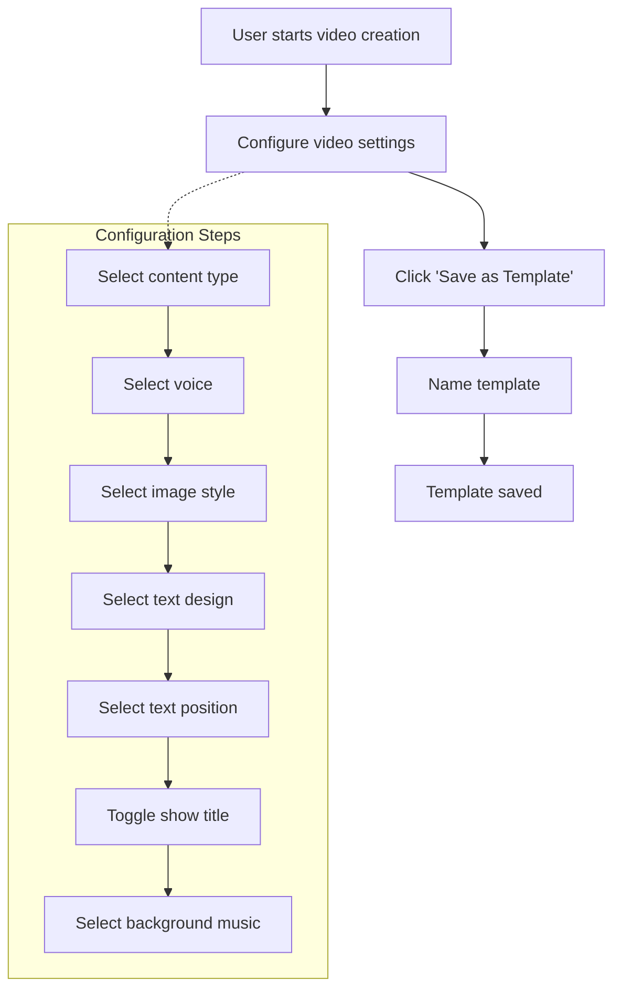
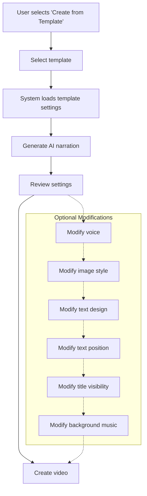
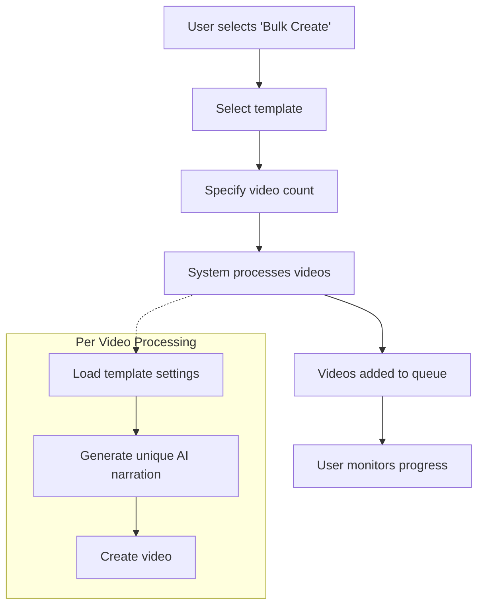

# Template Flow Diagrams

## Template Creation Flow

```mermaid
flowchart TB
    Start[User starts video creation]
    Config[Configure video settings]
    SaveTemp[Click 'Save as Template']
    NameTemp[Name template]
    SaveConfirm[Template saved]
    
    Start --> Config
    Config --> SaveTemp
    SaveTemp --> NameTemp
    NameTemp --> SaveConfirm
    
    subgraph "Configuration Steps"
        Content[Select content type]
        Voice[Select voice]
        Image[Select image style]
        Text[Select text design]
        Pos[Select text position]
        Title[Toggle show title]
        Music[Select background music]
        
        Content --> Voice
        Voice --> Image
        Image --> Text
        Text --> Pos
        Pos --> Title
        Title --> Music
    end
    
    Config -.-> Content
```

## Template Usage Flow

```mermaid
flowchart TB
    Start[User selects 'Create from Template']
    SelectTemp[Select template]
    LoadTemp[System loads template settings]
    GenNarr[Generate AI narration]
    Review[Review settings]
    Create[Create video]
    
    Start --> SelectTemp
    SelectTemp --> LoadTemp
    LoadTemp --> GenNarr
    GenNarr --> Review
    Review --> Create
    
    subgraph "Optional Modifications"
        ModVoice[Modify voice]
        ModImage[Modify image style]
        ModText[Modify text design]
        ModPos[Modify text position]
        ModTitle[Modify title visibility]
        ModMusic[Modify background music]
    end
    
    Review -.-> ModVoice
    ModVoice -.-> ModImage
    ModImage -.-> ModText
    ModText -.-> ModPos
    ModPos -.-> ModTitle
    ModTitle -.-> ModMusic
    ModMusic -.-> Create
```

## Bulk Creation Flow

```mermaid
flowchart TB
    Start[User selects 'Bulk Create']
    SelectTemp[Select template]
    Count[Specify video count]
    Process[System processes videos]
    Queue[Videos added to queue]
    Monitor[User monitors progress]
    
    Start --> SelectTemp
    SelectTemp --> Count
    Count --> Process
    Process --> Queue
    Queue --> Monitor
    
    subgraph "Per Video Processing"
        LoadTemp[Load template settings]
        GenNarr[Generate unique AI narration]
        CreateVideo[Create video]
        
        LoadTemp --> GenNarr
        GenNarr --> CreateVideo
    end
    
    Process -.-> LoadTemp
``` 